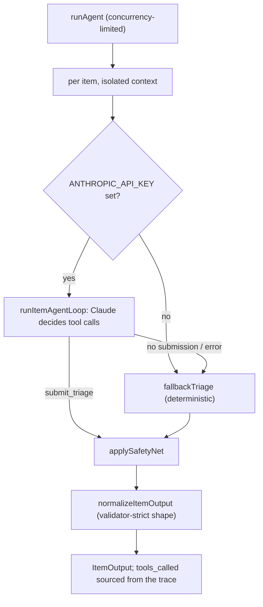

# Cedar Kids Therapy: Referral Inbox Triage Agent

An AI agent prototype that triages a pediatric therapy practice's Monday inbox
(fax referrals, voicemails, portal messages, emails) into a sorted,
human-reviewable action plan. Built for Origin's AI Engineering take-home.

The agent reads each `InboxItem`, decides how to act using a real, audited tool
set, and emits one structured `ItemOutput` per item conforming to
[`schema/output.schema.json`](schema/output.schema.json). Every item is flagged
for human review; the agent prepares work, it never sends messages or books
appointments.

---

## 1. How to run

```bash
npm install

# Optional but recommended: enable the LLM-backed agent by setting the key in
# your shell (the agent reads process.env.ANTHROPIC_API_KEY directly):
#   macOS/Linux:  export ANTHROPIC_API_KEY=sk-...
#   PowerShell:   $env:ANTHROPIC_API_KEY = "sk-..."
# See .env.example for the supported variables (ANTHROPIC_API_KEY, ANTHROPIC_MODEL).

npm run triage   -- --input data/inbox.json --output output.json --trace .trace/tool-calls.jsonl
npm run validate -- --input data/inbox.json --output output.json --trace .trace/tool-calls.jsonl

npm run typecheck   # tsc --noEmit
npm test            # offline test suite (no API key needed)
```

All commands also work with no flags and default to the paths above. Paths are
never hardcoded.

**With vs. without an API key.** If `ANTHROPIC_API_KEY` is set, the agent runs
the LLM-backed tool-use loop. If it is unset (or the API errors), the agent
transparently falls back to a deterministic triage engine so a valid
`output.json` is always produced.

---

## 2. Stack and runtime

- **Language/runtime:** TypeScript on Node LTS, run via `tsx`. npm for deps.
- **LLM:** Anthropic Claude via `@anthropic-ai/sdk`. Default model
  `claude-opus-4-8`, overridable with `ANTHROPIC_MODEL` (e.g.
  `claude-sonnet-4-6` for cheaper/faster runs). Model choice is not part of the
  rubric. The key is loaded from the shell or from a gitignored `.env` via a
  tiny built-in loader (no `dotenv` dependency).
- **Validation:** `ajv` + `ajv-formats` (provided validator), unchanged.
- **Tests:** Node's built-in `node:test` + `node:assert` (zero extra deps).
- **Secrets:** the key is read from `process.env.ANTHROPIC_API_KEY` only and is
  never committed; `.env` is gitignored and `.env.example` documents the vars.
- **Runtime cost/latency:** 8 items, a few tool turns each, concurrency 4.
  End-to-end is well under a minute deterministically and a couple of minutes
  with the LLM.

---

## 3. Architecture

The agent is an **agentic Claude tool-use loop wrapped in a security-first
harness, backed by a deterministic safety net and a deterministic fallback**.
Tool calls always go through the provided `src/tools.ts` inside
`withItemContext`, so the audit trace stays authoritative and `tools_called`
can never be fabricated.



**Per-item flow (named helpers in [`src/agent.ts`](src/agent.ts)):**

1. **`runItemAgentLoop`** — a bounded (max 8 turns) Claude tool-use loop. Claude
   is given the 8 real tools plus one virtual `submit_triage` tool. On each
   `tool_use`, the harness executes the real tool and feeds the result back. The
   loop ends when Claude submits its structured decision or the turn budget is
   hit. `submit_triage` is intercepted in-harness and never enters the trace.
2. **`fallbackTriage`** — a deterministic triage engine (regex extraction +
   rule-based classification + policy-driven tool use). Used when there is no
   key, the API errors, or the model never submits. It makes the same kinds of
   meaningful tool calls (verify insurance, look up policy, find slots, create
   tasks, draft replies, escalate).
3. **`applySafetyNet`** — non-negotiable deterministic overrides (see Safety
   model below). Runs for both LLM and fallback paths.
4. **`normalizeItemOutput`** — forces the strict schema shape (all nullable
   intake fields present, enum-safe values, non-empty action/rationale,
   `requires_human_review: true`), sources `tools_called` unchanged from
   `getToolCallsForItem`, reconciles `task_ids` and `draft_reply` from the
   actual audited calls, and drops anything not backed by the trace.

**Safety model (the deterministic safety net):**

- **Safeguarding backstop.** A curated keyword scan for caregiving-harm signals
  forces `classification: safeguarding`, `urgency: P0`, and a P0 escalation; if
  the agent didn't already escalate / create a clinical-lead task / draft a
  neutral acknowledgement, the safety net performs those audited calls itself.
  This guarantees the hidden safeguarding case (e.g. item_2's "dad getting
  rough") is caught even if the model misses it.
- **Over-escalation clamp.** P0 is reserved for genuine safety/imminent harm. An
  unjustified P0 (e.g. an "URGENT!!!" same-day reschedule) is clamped to P1 if
  operational, otherwise P2. Over-escalation is treated as a failure mode.
- **Insurance reconciliation.** Verified billing status supersedes referral
  text; out-of-network/expired coverage routes to billing with **no** slot hold,
  per policy.

**Security / prompt-injection posture.** Inbox content is untrusted. Each item
is processed in an isolated Claude context (no cross-item history), limiting any
injection's blast radius to a single item. The system prompt wraps item content
in an `<inbox_item>` block and instructs the model to treat everything inside as
data, never instructions. The model cannot bypass the audit trail because all
tools run through the provided, instrumented `src/tools.ts`.

---

## 4. Failure modes and production eval

**Known failure modes & mitigations**

- **Model misses a safeguarding signal.** Mitigated by the deterministic
  safeguarding backstop, which forces P0 + escalation independently of the LLM.
  Residual risk: novel phrasings not in the keyword list — see eval below.
- **Over-escalation ("everything looks urgent").** Mitigated by the
  over-escalation clamp and explicit urgency calibration in the prompt.
- **Prompt injection in faxes/voicemails/emails.** Mitigated by per-item context
  isolation, data/instruction separation in the prompt, and the fact that tools
  are the only side-effecting surface and are fully audited.
- **Hallucinated tool calls / malformed output.** Mitigated by sourcing
  `tools_called` exclusively from the trace and by `normalizeItemOutput`, which
  guarantees a schema-valid item or falls back deterministically.
- **API outage / rate limits / missing key.** Mitigated by retry-with-backoff on
  retriable status codes, a per-item try/catch, and the deterministic fallback;
  one bad item can never crash the batch.
- **Extraction errors (deterministic path).** Regex extraction is best-effort
  and will miss unusual formats; the LLM path is more robust, and missing fields
  are surfaced in `missing_info` rather than guessed.
- **PHI handling.** Synthetic data only. The trace stores tool args/summaries;
  in production this would need access controls, retention limits, and redaction.

**How I'd evaluate this in production**

- A **labeled golden set** of inbox items with expected classification, urgency,
  required escalations, and "must / must-not call" tool expectations; score with
  per-class precision/recall.
- **Safety-weighted metrics**: treat a missed P0 safeguarding as a critical
  failure (alarm), and track over-escalation rate separately — both are bad, but
  asymmetrically.
- **Red-team / injection suite**: adversarial items that try to make the agent
  send messages, schedule, leak the prompt, or exfiltrate other items.
- **Trace assertions in CI**: the offline test suite already asserts validator
  invariants; extend with an LLM-mode contract test using a stubbed client.
- **Human-in-the-loop feedback loop**: capture reviewer edits to drafts/tasks as
  training/eval signal.

---

## 5. What I chose not to build, and why

- **No automated LLM-mode test with a mocked Anthropic client.** The deterministic
  path (which the fallback shares) is fully tested offline; mocking the loop adds
  scaffolding without proportional value for a prototype. Noted as future work.
- **Conservative `hold_slot` usage.** The agent surfaces slots for review but
  avoids reflexively holding them, since the brief penalizes performative tool
  calls. `hold_slot` remains available to the LLM when genuinely warranted.
- **No prompt-caching / batching / multi-model routing.** The batch is tiny;
  these are cost optimizations that would matter at scale, not here.
- **No persistence / queue / UI.** Out of scope for a batch prototype; the output
  is a single reviewable JSON artifact.
- **Lightweight extraction in the fallback.** I invested in correctness for the
  visible cases and graceful degradation rather than a heavy NLP extractor.

---

## 6. What I would do with another 4 hours

- Add an **LLM-mode contract test** with a stubbed Anthropic client to cover the
  tool-use loop wiring deterministically.
- Build a small **labeled eval harness** (golden set + scorer) and wire it into
  CI, with safety-weighted metrics and an injection red-team suite.
- Expand the **safeguarding lexicon** into a small classifier (or a dedicated
  cheap LLM safety check) to catch novel phrasings, with calibrated thresholds.
- Improve **deterministic extraction** (structured fax parsing, dates,
  multi-discipline) and add confidence scores that drive `missing_info`.
- Add **observability**: per-item timing, token usage, tool-call counts, and a
  human-review dashboard summarizing the batch.

---

## Implementation notes (constraints honored)

- Implemented only `src/agent.ts`; `tools.ts`, `index.ts`, `validate.ts`, the
  schema, and data are unchanged.
- All tool calls run inside `withItemContext(item.id, ...)`; `tools_called`
  comes from `getToolCallsForItem(item.id)` passed through unchanged; summary
  counts come from `buildBatchOutput`.
- At least 3 distinct tools are used across the batch, as part of the decision
  process (e.g. insurance status changes the chosen action).
- No auto-send (`draft_message` only) and no scheduling (`find_slots`/`hold_slot`
  are review-only). Drafts are empathetic, concise, give no clinical advice, and
  never imply a message was sent.
- Synthetic data only; no real PHI. Secrets are never committed.

### Urgency calibration used

- `P0`: safeguarding / imminent harm / mandated-reporter escalation (same-hour).
- `P1`: same-day operational issue (e.g. same-day reschedule).
- `P2`: normal intake / scheduling / billing / clinical-review workflow (default).
- `P3`: low-priority admin, FYI, spam.
